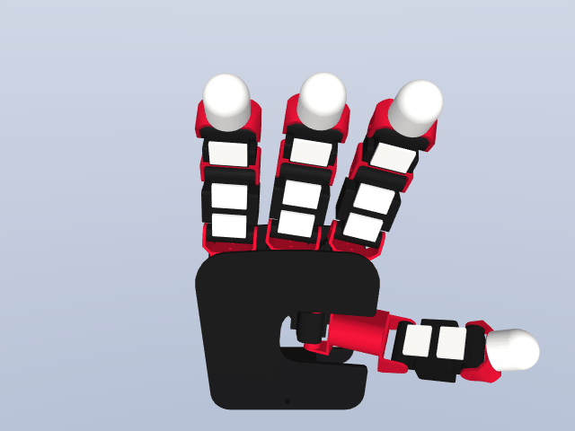

# Dex-urdf with KISTAR Hand family
This repository offers an assortment of high-quality models for dexterous hands and objects. Both of them are in URDF
format.

  + KISTAR Hand Real Hardware configure (PD gains for sim-to-real!)
  + KISTAR Hand + FR3 Hardware urdf

# KISTAR Hand Family (URDF + MJCF, hardware)

These are the CAD-derived hardware models of the KISTAR Hand family, distributed as URDF + MuJoCo MJCF
with STL meshes (left/right, plus Franka-bracket variants for `kistar_hand`). The previews below are
GIF animations + PNG stills rendered directly from the MJCF via [`tools/render_previews.py`](tools/render_previews.py).

> Note: the **simulation-ready USD/OBJ** version of the KISTAR Hand is the `KISTAR Hand` row in the
> gallery table above; the rows below are the raw hardware URDF/MJCF distribution of the same hand family.

> CAD: **Sungwoo Park** (Korea University / KIST) · URDF / MJCF / STL conversion: **Jaesung Lee** (KIST).
> License: **BSD-3-Clause**, © Korea Institute of Science and Technology. See `LICENSE_KISTAR` in each model folder.


|     Robot Model     |                            Animation                            |                          Still pose                           |   Format    |
|:-------------------:|:---------------------------------------------------------------:|:-------------------------------------------------------------:|:-----------:|
|  KISTAR Hand   | [](robots/hands/kistar_hand/kistar_hand.urdf) | [](robots/hands/kistar_hand/kistar_hand.urdf)  |URDF|
| KISTAR Hand (R) | [](robots/hands/kistar_hand/kistar_hand_right.urdf) | [](robots/hands/kistar_hand/kistar_hand_right.urdf) | URDF + MJCF |
| KISTAR Hand (L) | [](robots/hands/kistar_hand/kistar_hand_left.urdf) | [](robots/hands/kistar_hand/kistar_hand_left.urdf) | URDF + MJCF |
| KISTAR-SON (R) | [](robots/hands/kistar_son/kistar_son_right_mockup.urdf) | [](robots/hands/kistar_son/kistar_son_right_mockup.urdf) | URDF + MJCF |
| KISTAR-SON (L) | [](robots/hands/kistar_son/kistar_son_left_mockup.urdf) | [](robots/hands/kistar_son/kistar_son_left_mockup.urdf) | URDF + MJCF |


# Default Robot Hands

|   Robot Model   |                                                  Visual[^1]                                                  |                                                    Collision[^2]                                                    |
|:---------------:|:------------------------------------------------------------------------------------------------------------:|:-------------------------------------------------------------------------------------------------------------------:|
|  Allegro Hand   | [](robots/hands/allegro_hand/allegro_hand_right_glb.urdf) | [](robots/hands/allegro_hand/allegro_hand_right_glb.urdf)  |
|   Shadow Hand   |  [](robots/hands/shadow_hand/shadow_hand_right_glb.urdf)   |   [](robots/hands/shadow_hand/shadow_hand_right_glb.urdf)   |
| SCHUNK SVH Hand |  [](robots/hands/schunk_hand/schunk_svh_hand_right_glb.urdf)  | [](robots/hands/schunk_hand/schunk_svh_hand_right_glb.urdf) |
|  Ability Hand   | [](robots/hands/ability_hand/ability_hand_right_glb.urdf) | [](robots/hands/ability_hand/ability_hand_right_glb.urdf)  |
|    Leap Hand    |     [](robots/hands/leap_hand/leap_hand_right_glb.urdf)      |      [](robots/hands/leap_hand/leap_hand_right_glb.urdf)      |
|  DClaw Gripper  |    [](robots/hands/dclaw_gripper/dclaw_gripper_glb.urdf)    |    [](robots/hands/dclaw_gripper/dclaw_gripper_glb.urdf)     |
|  Barrett Hand   |     [](robots/hands/barrett_hand/bhand_model_glb.urdf)      |     [](robots/hands/barrett_hand/bhand_model_glb.urdf)     |
|  Inspire Hand   |   [](robots/hands/inspire_hand/inspire_hand_right.urdf)   |   [](robots/hands/inspire_hand/inspire_hand_right.urdf)    |
|  Panda Gripper  |    [](robots/hands/panda_gripper/panda_gripper_glb.urdf)    |    [](robots/hands/panda_gripper/panda_gripper_glb.urdf)     |

[^1]: Ray tracing animation are rendered in `SAPIEN` using the urdf with `glb` version. Code can be found
in [generate_urdf_animation_sapien.`py](tools/generate_urdf_animation_sapien.py).
[^2]: Collision mesh are rendered in `SAPIEN` using the same urdf as the visual. Blue links are modeled using primitives
while green links are modeled using convex triangle meshes. Code can be found
in generate_urdf_collision_figure_sapien.py](tools/generate_urdf_collision_figure_sapien.py).

URDF Parser Links:
[yourdfpy](https://github.com/clemense/yourdfpy),
[IsaacGym](https://developer.nvidia.com/isaac-gym),
[SAPIEN](https://sapien.ucsd.edu/),
[PyBullet](https://pybullet.org/wordpress/)


## Robot Source

|   Robot Model   |                          Official Website                           |                                                 URDF Source                                                 |                                    CAD Model Source                                    |     License     |
|:---------------:|:-------------------------------------------------------------------:|:-----------------------------------------------------------------------------------------------------------:|:--------------------------------------------------------------------------------------:|:---------------:|
|  KISTAR Hand   | [PRIME Lab](https://www.dhwanglab.com/home) | [kistar_ros](https://github.com/KIST-PRIME-Lab/Franka_Dual_Arm_PtoP) |                                          N/A                                           |       BSD       |
|  KISTAR-SON   | [PRIME Lab](https://www.dhwanglab.com/home) | [KISTAR_URDF](https://github.com/KIST-PRIME-Lab) (CAD: Sungwoo Park · URDF/MJCF: Jaesung Lee, KIST) |                                          N/A                                           |   BSD-3-Clause   |
|  Allegro Hand   | [Wonik Robotics](https://www.wonikrobotics.com/research-robot-hand) | [allegro_hand_ros](https://github.com/simlabrobotics/allegro_hand_ros/tree/master/allegro_hand_description) |                                          N/A                                           |       BSD       |
|   Shadow Hand   |        [Shadow Robot Company](https://www.shadowrobot.com/)         |                           [sr_common](https://github.com/shadow-robot/sr_common)                            |                                          N/A                                           |     GPL-3.0     |
| SCHUNK SVH Hand |                 [SCHUNK](https://schunk.com/us/en)                  |             [schunk_svh_ros_driver](https://github.com/SCHUNK-GmbH-Co-KG/schunk_svh_ros_driver)             |                                          N/A                                           |   Apache-2.0    |
|  Ability Hand   |                 [PSYONIC](https://www.psyonic.io/)                  |                     [ability-hand-api](https://github.com/psyonicinc/ability-hand-api)                      |                                          N/A                                           |       N/A       |
|    Leap Hand    |                  [Leap Hand](http://leaphand.com)                   |          [LEAP_Hand_Sim](https://github.com/leap-hand/LEAP_Hand_Sim/tree/master/assets/leap_hand)           |                     [Leap Hand CAD](http://leaphand.com/assembly)                      |  MIT   |
|  DClaw Gripper  |     [Robel Benchmark](https://github.com/google-research/robel)     |                                                     N/A                                                     | [D'Claw CAD](https://drive.google.com/drive/folders/1H1xN5BU03-eXjuEyIL_iJ_4XzrdDSnlM) |   Apache-2.0    |
|  Barrett Hand   |  [Barrett Technology](http://barrett.com/robot/products-hand.html)  |                        [bhand_model](https://github.com/jhu-lcsr-attic/bhand_model)                         |    [BarrettHand CAD](https://github.com/jhu-lcsr-attic/bhand_model/tree/master/cad)    |       BSD       |
|     DexHand     |                 [DexHand](https://www.dexhand.org/)                 |  [dexhand_description ](https://github.com/iotdesignshop/dexhand_description/blob/main/urdf/dexhand.urdf)   |               [Dexhand](https://github.com/TheRobotStudio/V1.0-Dexhand)                | CC BY-NC-SA 4.0 |
|  Inspire Hand   |          [Inspire-Robot](https://www.inspire-robots.com/)           |                                                     N/A                                                     |             [inspire_hand](https://www.inspire-robots.com/download/frwz/)              | CC BY-NC-SA 4.0 |

## Quick test your own model

## Installation
```shell
conda create -n dex-urdf python=3.11 -y
python -m pip install -r requirements.txt
```

## Test scripts
```shell
## Robot animation rendering 
python tools/generate_urdf_animation_sapien.py ../robots/hands/kistar_hand/kistar_hand.urdf --output-video-path output/kistar_hand.mp4 --headless

## Robot collision mesh rendering
python tools/generate_urdf_collision_figure_sapien.py robots/hands/kistar_hand/kistar_hand.urdf --output-image-path output/kistar_hand.png --headless
```

## Citation

If you use dex_urdf in your work, please use the following citation:

```
@article{bunny-visionpro,
    title={Bunny-VisionPro: Real-Time Bimanual Dexterous Teleoperation for Imitation Learning},
    author={Runyu Ding and Yuzhe Qin and Jiyue Zhu and Chengzhe Jia and Shiqi Yang and Ruihan Yang and Xiaojuan Qi and Xiaolong Wang},
    year={2024},
    url={https://arxiv.org/abs/2407.03162},
}
```

This repository contains models derived from open-source contributions by various developers and manufactures.
The development of dex_urdf was made possible thanks to the generous work of numerous designers and engineers.
We extend our sincere appreciation to all those whose efforts have contributed to this project.
